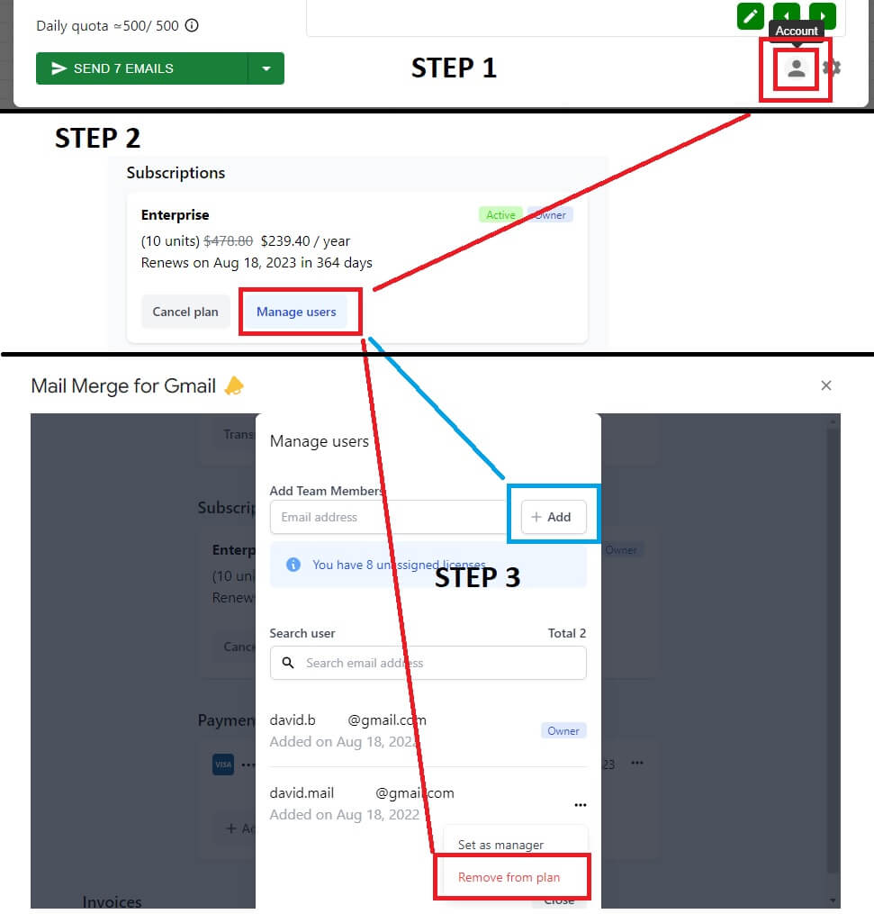

# Shared subscription

### What is a shared subscription in Mail Merge for Gmail? 

If you need to :

* **Have multiple Mail Merge for Gmail licences for your team**
* **Have a centralized way, role based system to manage your licences**
* **Get one bill for your entire organization**

Shared subscriptions are available in Mail Merge for Gmail for every owner of a premium subscription.

Here are the topics that we are going to cover in this article :

### How to add/remove a new user on your shared subscription? 

1. Access to the account management screen directly from the add-on.
2. From the account management screen you can click on "Manage users" , in section "Subscriptions"
3. The user management screen allow you to add or remove a user from your subscription

### How to leverages roles in a shared Subscription? 

#### What are the roles? 

There is 3 roles in a shared subscription :

* **Owner :**
  * There is only one owner per shared subscription.
  * Owner can manage billing informations
  * Owner can add or remove licences from a subscription.
  * Owner has is own license and can use Mail Merge for Gmail
* **Manager :**
  * A shared subscription can have multiple user with role "manager"
  * Manager can add or remove licences from a subscription,
  * Manager has is own license and can use Mail Merge for Gmail
* **User :**
  * A shared subscription can have multiple user with role "user"
  * user has is own license and can use Mail Merge for Gmail without any administrative permissions.

#### How to assign a role to a user? 

* Access to the account management screen directly from the add-on.
* From the account management screen you can click on "Manage users" , in section "Subscriptions"
* The user management screen allow owner to assign or remove roles

### How will it impact my invoices? 

* **Adding or removing user to a subscription will not change billing period or billing dates** : your billing date, monthly or yearly will remain the same than the original subscription.
* **If you add a new license to a shared subscription** :
  * You will be **charged immediately** for the prorated remaining time before the next invoice.
  * Your **next invoice** will reflect the new number of licences of your subscription.

_Example:_

_If you have a yearly subscription ($47.88) created on 1st January 2022 and you add a license on 1st of June 2022:_

1. _You will be charged immediately for $23.94 (because there is half of the billing period remaining)_
2. _Next invoice on 1st January2023 will be $95.76 ( = 2x $47.88)_

* **If you remove a license from a shared subscription** :
  * Your account balance will be credited with the prorated amount for the remaining time of your subscription.
  * Your **next invoice** will reflect the new number of licences of your subscription.

_Example :_

_If you have a monthly subscription with 4 licenses for a monthly cost of $19.86 (4x$4.99) and you decide to remove a licence : next invoice will be $14.97 (3x$4.99)_
