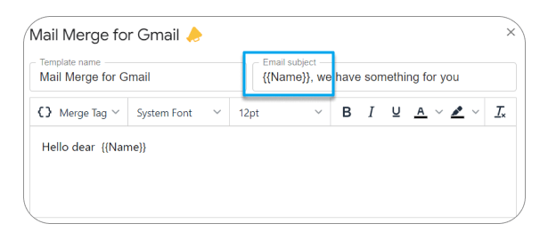

# Mail Merge Tutorial

First, make sure you have installed Mail Merge for Gmail from the [Google Workspace Marketplace](https://workspace.google.com/marketplace/app/mail\_merge\_for\_gmail\_%F0%9F%93%A3/562406866377). Once installed, let's see how to personalize and send your first emails.


A short video to cover the basics of Mail Merge for Gmail


## Personalize your email content

With Mail Merge for Gmail📣, **you can change the content of each email received** by each recipient. This is what we call personalization.&#x20;

### Start with the Google Sheet content

The idea is simple, in your Google Sheet, **each row will represent an email.** The minimal requirement to send a campaign is to have a column with all the recipients _(Column "A" in the screenshot below)_.

<figure><figcaption>
Start with data
</figcaption></figure>

You can add as many columns as you want, and you will be able to retrieve them in the template editor._( Column Name / Company ...)_

### Customize your email template

In the template editor, You are now able to retrieve your Spreadsheet data to customize your emails, through what we call **merge tags.**&#x20;

<figure><figcaption>
headers in your spreadsheet..
</figcaption></figure>

Merge tags are simply names of your columns, surrounded with characters \{{ \}}. For instance, if you want to use the "Name" column in your template, bring it with \{{ Name\}}.

You don't have to type merge tags, just use our dropdown menu :&#x20;

<figure><figcaption>
..becomes merge tags in the template editor!
</figcaption></figure>

## Personalize your email subject

To customize your email subject, you can also use Merge tags. For instance, if your Google Sheets contains a column "Name", **you can customize your email subject using merge tag** "\{{Name\}}" as show below:

<figure><figcaption>
Customize email subjects signficantely improve your opening rates
</figcaption></figure>

