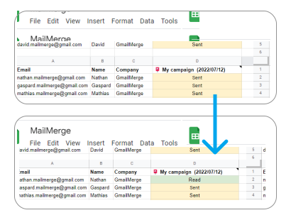

# Email Tracking

## How to enable email tracking?

To activate tracking, simply tick "Track emails" in the add-on

<figure><figcaption>
activate email tracking
</figcaption></figure>

## How will tracking look like ?

Tracking status will be available in your spreadsheet. When the email will be opened, the status will change from "Sent" to "Read" :&#x20;

<figure><figcaption>
Example of an email tracked
</figcaption></figure>

## When is the tracking status updated ?

Tracking status is updated when your Google Sheets is loaded, but you can refresh it at any time going to _Menu / Extensions / Mail Merge for Gmail📣 / 🔄 Refresh tracking_


We have a nice article explaining how read receipts works available [here](https://merge.email/gmail-knowledge/gmail-read-receipt)!

